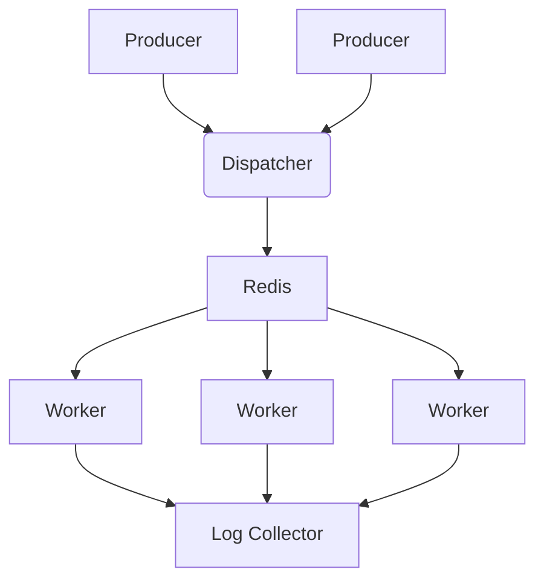

# Smart Routing

## Project Description
This project implements a producer / consumer model to run tasks in a pool of workers. Each worker is a process that listens for tasks from a dispatcher on a queue, processes them, and can return results to the dispatcher if requested.

Each worker can be associated with a limited set of *labels* at any given time, and each task is assigned with a particular label. Motivation for this will be given below. It is assumed that assigning a new label to a worker is expensive. Ideally, the dispatcher would send tasks to workers that have the required label already assigned to them.

### Motivation
This arose from a system where we had several workers in a pool for running tasks that consisted of inference with ML models. The workers had access to a common cache of these models, but loading them into memory was very expensive and could result in significant delays for processing tasks. Therefore, the idea arose to have a system that could automatically send tasks directly to workers that already had the required model loaded instead of a common queue, and thus reduce the loading overhead.

In this project, the ML models have been abstracted to "labels" that take some time for the workers to load. The implementation is pretty bare-bones for testing purposes, but it can ideally be used as a template to develop another system that has a similar producer / consumer model which fits the "labels" model.

### Architecture
The architecture of the project is based on a producer / consumer model with the following components:
- **Dispatcher**: This acts as the central hub to receive tasks and run them on the workers. It is an HTTP server implemented in Go that receives tasks from a producer and dispatches them to workers based on the labels assigned to them.
- **Worker**: This is a Python process that listens for tasks from the dispatcher on a queue.
- **Redis**: This is used as the message broker to handle the communication between the dispatchers and workers. I chose this because of its simplicity and versatility, and this layer allows the dispatcher and worker to be decoupled and scaled independently.
- **Log Collector**: This is a Go process that collects logs from the workers for later debugging purposes.



## Project Structure
The project has components that are implemented both in the Go and Python programming languages. The source code for the components is in the `packages` folder and is organized as follows:
```
packages/
├── dispatcher       # (GoLang) Component that dispatches tasks to workers
├── log-collector    # (GoLang) Component to collect logs from workers
├── worker           # (Python) Component that processes tasks
└── benchmark        # (GoLang) Components to run benchmarks with simulated traffic
```
The dispatcher, log collector, and worker have `Dockerfile`s, and there is a `docker-compose.yml` file to spin up these services easily. The root directory also contains a `Taskfile.yml` file to run tasks using the [Task](https://taskfile.dev/) tool. Other files in the root folder are related to python setup and packaging.

## Setup Instructions

In order to run the project, you should have Docker, Python, and Go installed on your machine. Python packages are managed with the `uv` tool, with `pytest` for testing, and `ruff` for formatting.

The `Taskfile.yml` contains several useful tasks to help you get started. Some of the tasks included are:
- `task unit-tests`: Run unit tests for all components. Some python tests require a local running redis instance, and you can skip them with `task unit-tests -- -m "not live_redis"`.
- `task start`: Start the services using Docker Compose.
- `task stop`: Stop the services using Docker Compose.
- `task build-producer`: Build the producer component. The binary executable will be stored in the `bin` folder.

## Running Benchmarks

### Instructions
In order to run benchmarks on the service, you can use the `task run-benchmark` command. This will build and spin up the services, then run a number of requests with a given number of concurrent workers. Finally, it will parse the log files produced to show some summary statistics, and shut down the services.

You can run the benchmarks with the following command (showing some of the possible options):
```bash
# Options:
# 'NUM_WORKERS': Number of workers to run in the pool: 2
# 'RANDOM_DISPATCH': Set to true to send all tasks to the common queue
# 'requests': Number of requests to send: 10
# 'producers': Number of clients that will send requests concurrently: 2
# 'wait-avg': Avg wait time each client waits between requests (seconds): 1.0
# 'wait-stddev': Std deviation of the wait time between requests: 0.5
# 'labels': Number of different labels to include in the requests: 2
task run-benchmark NUM_WORKERS=2 RANDOM_DISPATCH=false -- \
    --requests 10 \
    --producers 2 \
    --wait-avg 1.0 \
    --wait-stddev 0.5 \
    --labels 2
```

### Some Results
